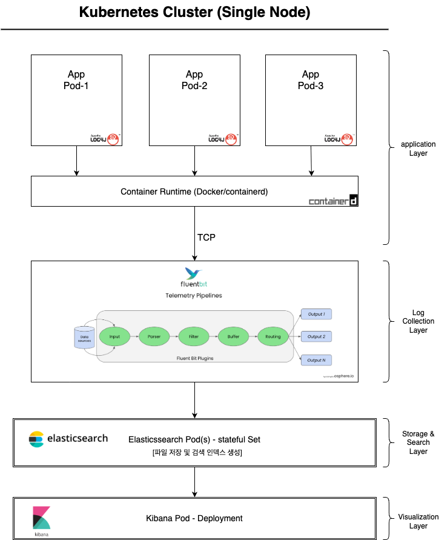
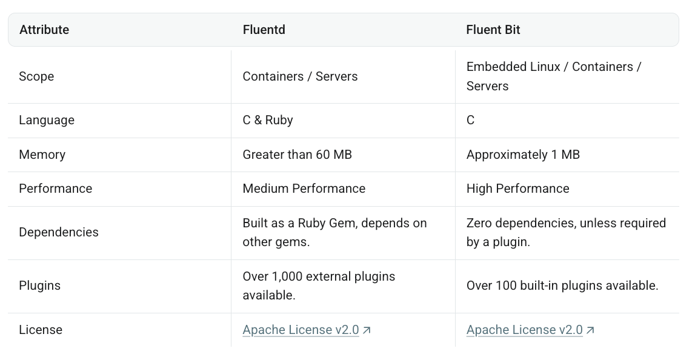

# Scheme

(구성) k8s Single Node에 대해 구성도 수립

- 한 노드내에서 application별로 컨테이너 기반하여 pod를 구성
    - App Pod-1
    - App Pod-2
    - App Pod-3

- 개별 application은 log4j2를 통해 로그 데이터 생성

- 개별 컨테이너가 생성한 로그 데이터를 DaemonSet 기반 fluentd를 통해 중앙 집중화

- elasticsearch 및 kibana를 통해 로그 파일 저장 및 시각화

- fluentd, elasticsearch, kibana 인프라 구성은 하나의 docker-compose.yml로 작성하여 관리 예정

# Process

## Application Layer

1. (Spring Filter) Application Pod별 HttpReqResLoggingFilter 및 p6spy request, response에 대한 로깅 데이터 수집

2. (Log4j2) 현 ENVION 시스템에서 사용중인 log4j2 기능을 바탕으로 콘솔 및 TCP 방식으로 Fluent-bit로 전달

    a. CONSOLE_APPENDER

    b. ASYNC_FLUENTBIT_APPENDER
        1. HttpReqResLoggingFilter
        2. p6spy
        3. org.hibernate.SQL 

## Log Collection Layer - Fluentd or FluentBit

- (중앙화) Fluentd를 통해 컨테이너 별 로그를 수집하여 중앙화

    - k8s 오브젝트인 daemonSet를 사용하여 application과 독립적인 환경 구성

- (전송) 정제된 로그 데이터를 elasticsearch로 전송

*경량화를 위해 fluentbit 고려

https://docs.fluentbit.io/manual/about/fluentd-and-fluent-bit

## Storage & Search Layer - Elasticsearch

- (저장 및 검색 인데스 생성) Fluentd로 전달받은 데이터에 인덱스를 활용해 최종 로그 데이터 저장

- (GUI 확장 프로그램) Multi Elasticsearch Heads

## Visualization Layer - Kibana

- (시각화) 수집된 로그를 kibana에 기반하여 dashboard형태로 로그 모니터링 및 검색

  - timestamp

  - application name

  - etc.

# 기타 고려사항

- 로그 레벨에 따라 관리 세부 정책 수립 고려

  - trace

  - debug

  - info

  - warn

  - error

- 로그 레벨에 따른 별도 알림 기능

  - ex) 시스템 장래를 초래할 error에 따른 개발자 노티 알림

